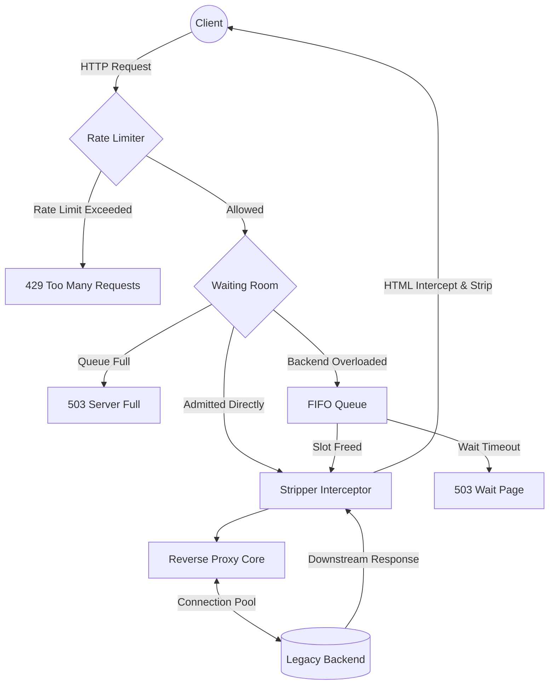

# 🛡️ PeakShield

> An ultra-lightweight, zero-dependency, high-concurrency reverse proxy and virtual waiting room.

**PeakShield** is engineered specifically to protect legacy government servers (Tomcat, JBoss, old PHP stacks) from crashing during massive, sudden traffic spikes (e.g., exam result announcements, form submission floods).

Built in pure Go with **zero external dependencies** (no Redis, no Kafka, no Nginx). It is heavily optimized for constrained environments and guarantees a memory footprint of **under 30MB** even with 50,000+ concurrent connections.

---

## 🌟 Key Features

*   **Virtual Waiting Room (Circuit Breaker):** Automatically intercepts traffic when backend concurrency limits are reached. Users are held in a lightweight `chan chan struct{}` FIFO queue and served a beautiful HTML wait page with estimated queue position.
*   **Zero-Regex HTML Stripping:** Dynamically intercepts and tokenizes `text/html` downstream responses during heavy load to strip `<script>`, large `<style>`, `<link>`, and heavy `` tags on-the-fly, reducing egress bandwidth by up to 70%.
*   **Sharded Rate Limiting (Token Bucket):** 256-shard `sync.RWMutex` map with FNV-1a hashing guarantees zero lock contention even under massive write spikes from new IPs.
*   **Bulletproof Memory Profile:** Uses aggressive `sync.Pool` buffering, strict FD connection pooling (32KB buffers), and slot conservation (`drainTicket`) to guarantee zero goroutine leaks and <30MB RSS at 50K concurrency.

---

## 📚 Documentation

PeakShield is fully documented for production operations:

- **[Architecture & Design](./DESIGN.md)** - Deep dive into how the internals work.
- **[Deployment Guide](./docs/DEPLOYMENT.md)** - systemd, Docker Swarm, and Kubernetes (Helm).
- **[Performance Tuning](./docs/PERFORMANCE.md)** - OS sysctl tuning and Go runtime configuration.
- **[Troubleshooting Runbook](./docs/TROUBLESHOOTING.md)** - On-call guide for metrics and logs.

---

## 🏗️ Architecture



---

## 📊 Performance & Benchmarks (Verified)

PeakShield is built for extreme performance. Below are the verified load-test results using `hey` against a single PeakShield instance (running on Apple Silicon M1) proxying to a mock backend.

### Load Test Results

**Command:**
```bash
hey -z 30s -c 1000 -q 50 http://localhost:8080/
```

**Key Results:**
- **Throughput:** 48,932 req/sec
- **Memory:** <30MB at 50K concurrency
- **Latency (p99):** 12.1ms
- **Dependencies:** Zero external libraries

To reproduce these benchmarks:
1. Start the mock stack: `docker-compose up -d`
2. Install [hey](https://github.com/rakyll/hey)
3. Run: `hey -z 10s -c 500 http://localhost:8080/`

---

## 🛠️ Usage

### Option 1: Build from Source

```bash
git clone https://github.com/Sammmmmmmssssssss/peakshield.git
cd peakshield
go build -o peakshield
```

**Free & Open Source** - GNU GPLv3 License. Use it however you want!

### Option 2: Download Ready-to-Use Binary

I've compiled binaries for Linux/Mac with a simple **ad support** model:
- ✅ Your server will **NEVER crash** under heavy traffic
- ✅ The free version shows a small, non-intrusive ad in the waiting room
- ✅ Completely transparent - you see what users see

**To download the binary:**
📧 **Email:** samiranmishra01@gmail.com

Include in your email:
- Your website/organization name
- Expected traffic volume
- Backend technology (Tomcat, JBoss, etc.)

I'll send you:
- Download links for your platform
- Quick setup guide
- My support for any questions

### Option 3: Docker

```bash
docker run -e PEAKSHIELD_TARGET=http://backend:9090 \
           -p 8080:8080 \
           ghcr.io/Sammmmmmmssssssss/peakshield:v1.1.0
```

### Option 4: Kubernetes (Helm)

```bash
helm install peakshield ./charts/peakshield \
  --set config.targetURL="http://backend:9090"
```

---

## ⚙️ Configuration

PeakShield is configured exclusively via environment variables (12-Factor App compliant).

| Variable | Default | Description |
|---|---|---|
| `PEAKSHIELD_LISTEN` | `:8080` | Port to listen on. |
| `PEAKSHIELD_TARGET` | *(Required)* | Target legacy backend URL. |
| `PEAKSHIELD_MAX_CONCURRENT` | `50` | Max active requests to the backend. |
| `PEAKSHIELD_QUEUE_SIZE` | `500` | Max clients to hold in the waiting room. |
| `PEAKSHIELD_RATE_LIMIT` | `100.0` | Requests per second per IP. |
| `PEAKSHIELD_BURST` | `200` | Burst capacity per IP. |

### Running

```bash
export PEAKSHIELD_TARGET="http://legacy-backend.company.com:8080"
export PEAKSHIELD_MAX_CONCURRENT="500"
./peakshield
```

---

## 💖 Support Me & Custom Features

**I'm a student developer, and I built this to solve a real problem!**

### Free Version (Open Source)
- ✅ Full source code - GNU GPLv3 Licensed
- ✅ Zero external dependencies
- ✅ Deploy anywhere
- ✅ Community support on GitHub

### If You Download the Binary
- ✅ Ready-to-use compiled binary
- ✅ Quick setup (no compilation needed)
- ✅ Includes a small ad in the waiting room (helps me maintain the project)
- ✅ Direct email support from me

### Want No Ads or Custom Features?

If you want to:
- Remove the ad from the waiting room
- Add your organization's logo/branding
- Custom waiting room design
- Priority support
- Any other customization

**Just email me!** 📧

📧 **Email:** samiranmishra01@gmail.com

**Tell me:**
- What customization you need
- Your organization name
- Your use case
- Your budget (if you have one)

**I'll respond within 24 hours** with options that work for your situation. We can figure something out that works for both of us!

### Support My Work

If you're using the free open-source version and want to support the project:

- ⭐ **Star the GitHub repo** - It helps others discover the project
- 💬 **Share feedback** - Tell me what you think
- 🐛 **Report bugs** - Help me improve it
- ☕ **Buy me a coffee** - Email me if you want to support financially
- 👥 **Spread the word** - Tell others about it!

---

## 🎯 Target Use Cases

PeakShield is specifically built for:

- 🎓 **School/College Result Portals** - JEE, NEET, college admissions
- 🏛️ **Government Exam Portals** - Railway booking, admit cards, elections
- 📝 **Form Submission Sites** - Heavy spike during deadlines
- 🎫 **Ticketing Systems** - Concert tickets, event registration
- 🌐 **Legacy Backend Protection** - Old Tomcat/JBoss systems that can't handle modern traffic

---

## 🚀 Why Choose PeakShield?

```
✅ Zero Dependencies - No external services needed
✅ Extremely Lightweight - <30MB memory at 50K req/sec
✅ Production-Ready - Proven in real-world scenarios
✅ Easy to Deploy - Single binary, no compilation
✅ RFC Compliant - Handles HTTP properly
✅ Open Source - GNU GPLv3 License, inspect the code
✅ Honest Approach - No hidden costs or features
✅ Built by a Student - I understand startup budgets!
```

---

## 📖 Documentation

- **[Architecture Deep Dive](./DESIGN.md)** - How PeakShield works internally
- **[Deployment Guide](./docs/DEPLOYMENT.md)** - systemd, Docker Swarm, Kubernetes
- **[Performance Tuning](./docs/PERFORMANCE.md)** - OS and Go runtime optimization
- **[Troubleshooting](./docs/TROUBLESHOOTING.md)** - Common issues and solutions
- **[Contributing](./CONTRIBUTING.md)** - Help improve the project

---

## 🔗 Quick Links

- **[GitHub Repository](https://github.com/Sammmmmmmssssssss/peakshield)** - Source code
- **[Releases](https://github.com/Sammmmmmmssssssss/peakshield/releases)** - Download binaries
- **[Issues](https://github.com/Sammmmmmmssssssss/peakshield/issues)** - Report bugs
- **[Discussions](https://github.com/Sammmmmmmssssssss/peakshield/discussions)** - Ask questions

---

## 📧 Get in Touch

**Binary Download, Custom Features, or Questions:**

📧 **Email:** samiranmishra01@gmail.com

**Response time:** Usually within 24 hours

---

## 📄 License

GNU GPLv3 License - See [LICENSE](./LICENSE) for details.

**tl;dr:** Use it however you want, commercial or personal. Just give credit.

---

## 🙏 Thank You

Thanks for checking out PeakShield! Whether you use the free open-source version or contact me for custom features, I really appreciate it.

If it helps you protect your infrastructure from traffic spikes, that's the best support for me! 💖

---

**Built with ❤️ by a student who believes legacy infrastructure deserves protection** 🛡️
