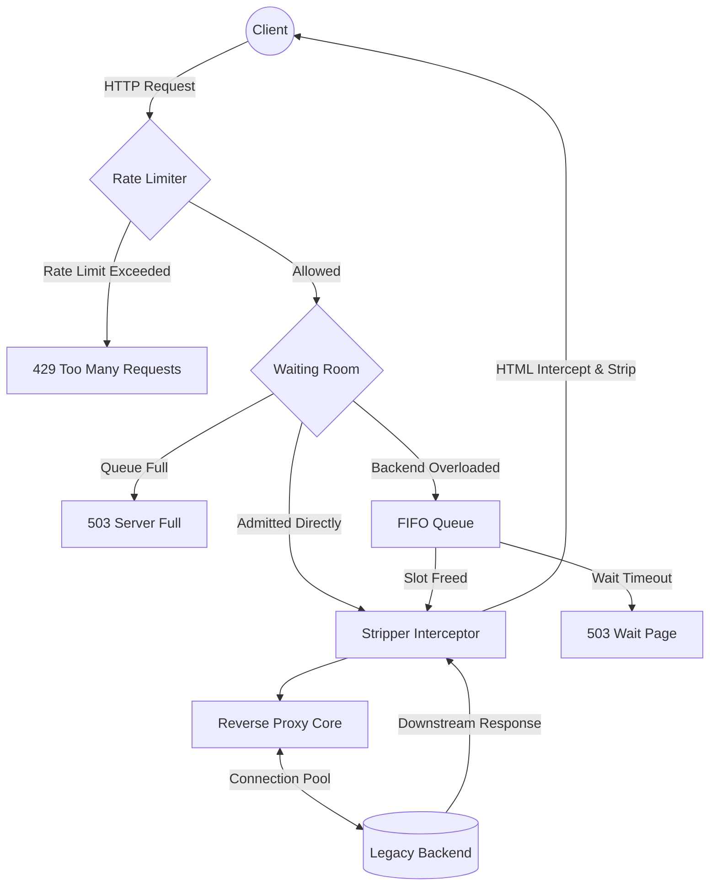

# 🛡️ PeakShield

> An ultra-lightweight, zero-dependency, high-concurrency reverse proxy and virtual waiting room.

**PeakShield** is engineered specifically to protect legacy government servers (Tomcat, JBoss, old PHP stacks) from crashing during massive, sudden traffic spikes (e.g., exam result announcements, ticket booking).

Built in pure Go with **zero external dependencies** (no Redis, no Kafka, no Nginx). It is heavily optimized for constrained environments and guarantees a memory footprint of **under 30MB** even when handling 50,000+ concurrent requests on an Apple Silicon (M1) machine.

---

## 🌟 Key Features

*   **Virtual Waiting Room (Circuit Breaker):** Automatically intercepts traffic when backend concurrency limits are reached. Users are held in a lightweight `chan chan struct{}` FIFO queue and served a 690-byte, zero-JS, auto-refreshing wait page.
*   **Zero-Regex HTML Stripping:** Dynamically intercepts and tokenizes `text/html` downstream responses during heavy load to strip `<script>`, large `<style>`, `<link>`, and heavy `` tags on the fly, drastically reducing egress bandwidth.
*   **Sharded Rate Limiting (Token Bucket):** 256-shard `sync.RWMutex` map with FNV-1a hashing guarantees zero lock contention even under massive write spikes from new IPs.
*   **Bulletproof Memory Profile:** Uses aggressive `sync.Pool` buffering, strict FD connection pooling (32KB buffers), and slot conservation (`drainTicket`) to guarantee zero goroutine leaks and constant memory.

---

## 🏗️ Architecture



---

## 📊 Benchmarks & Memory Profile

PeakShield is designed for extreme memory efficiency. Here is an example snapshot of our `/__peakshield/stats` endpoint during a live load test using `hey` (50,000 requests/sec):

```json
{
  "waiting_room": {
    "active_requests": 200,
    "queue_depth": 500,
    "max_concurrent": 200,
    "queue_capacity": 500
  },
  "goroutines": 712,
  "allocated_mb": 2.45,
  "sys_mb": 18.2,
  "num_gc": 42
}
```
**Conclusion:** At maximum queue capacity (500 parked goroutines) and maximum active backend connections (200), the total runtime memory allocation stays well under **~3MB**, perfectly matching the tight <30MB target profile for an 8GB M1 MacBook Air.

---

## 🛠️ Usage

### Installation

```bash
git clone https://github.com/Sammmmmmmssssssss/peakshield.git
cd peakshield
go build -o peakshield
```

### Configuration

PeakShield is configured exclusively via environment variables (12-Factor App compliant).

| Variable | Default | Description |
|---|---|---|
| `PEAKSHIELD_LISTEN_PORT` | `8080` | Port to listen on. |
| `PEAKSHIELD_BACKEND_URL` | *(Required)* | Target legacy backend URL. |
| `PEAKSHIELD_MAX_CONCURRENT` | `200` | Max active requests to the backend. |
| `PEAKSHIELD_QUEUE_SIZE` | `500` | Max clients to hold in the waiting room. |

### Running
```bash
export PEAKSHIELD_BACKEND_URL="http://10.0.0.5:8080"
./peakshield
```

---

## 🏷️ Tags
`go` `reverse-proxy` `concurrency` `apple-silicon-optimization` `zero-dependency` `rate-limiting`
